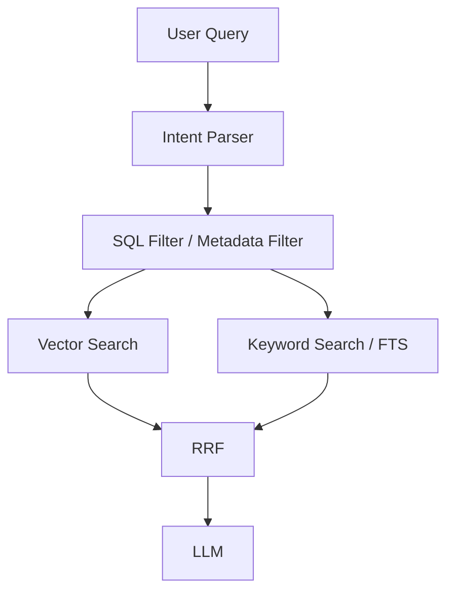

# AI Agents Demo

Dự án này là một bộ agent Python dùng `openai-agents` để điều phối nhiều tác vụ khác nhau:

- **Local Assistant Agent**: trả lời câu hỏi chung bằng model chạy local qua Ollama.
- **Server Product Agent**: tìm kiếm sản phẩm máy chủ từ PostgreSQL Vector Database.
- **Orchestrator Agent**: chọn agent phù hợp dựa trên câu hỏi của bạn.

## Yêu cầu

- Python 3.10+.
- Ollama đã cài trên máy.
- PostgreSQL nếu bạn muốn dùng tính năng tìm sản phẩm máy chủ.

## Cài đặt

1. Tạo và kích hoạt virtual environment.
2. Cài dependencies:

```bash
pip install -r requirements.txt
```

3. Cài model local (ví dụ):

```bash
ollama pull qwen2.5:7b-instruct
```

4. Tạo file `.env` từ `.env.example` và điền thông tin kết nối.

## Biến môi trường

### Bắt buộc cho agent

- `OPENAI_BASE_URL`: endpoint OpenAI-compatible của Ollama, mặc định `http://localhost:11434/v1`.
- `OPENAI_API_KEY`: giá trị bất kỳ (ví dụ `ollama`) để tương thích client OpenAI.
- `LOCAL_MODEL`: tên model Ollama dùng cho các agent (ví dụ `qwen2.5:7b-instruct`).

### Dùng cho tìm sản phẩm máy chủ

Các biến này đã có mẫu trong `.env.example`:

- `POSTGRES_HOST`
- `POSTGRES_PORT`
- `POSTGRES_DB`
- `POSTGRES_USER`
- `POSTGRES_PASSWORD`
- `POSTGRES_TABLE`

Ví dụ:

```env
OPENAI_BASE_URL=http://localhost:11434/v1
OPENAI_API_KEY=ollama
LOCAL_MODEL=qwen2.5:7b-instruct

POSTGRES_HOST=localhost
POSTGRES_PORT=5432
POSTGRES_DB=server_products
POSTGRES_USER=postgres
POSTGRES_PASSWORD=your_password_here
POSTGRES_TABLE=products
```

## Cách chạy

### 1. CLI Mode (Terminal)

Chạy chương trình chính:

```bash
python main.py
```

Sau khi chạy `python main.py`, chương trình sẽ mở một vòng lặp nhập liệu trong terminal:

1. Gõ câu hỏi hoặc yêu cầu của bạn vào dòng `Enter the query:`.
2. Nhấn `Enter` để gửi.
3. Agent sẽ trả lời trực tiếp trong terminal.
4. Bạn có thể tiếp tục nhập câu hỏi mới ngay sau đó.

Thoát bằng `Ctrl + C`.

### 2. Web UI Mode (Streamlit) - 🎉 **RECOMMENDED**

Chạy Streamlit UI để tương tác thuận tiện hơn:

```bash
streamlit run streamlit_app.py
```

Ứng dụng sẽ mở ở `http://localhost:8501` với các tính năng:

- ✅ **Chat Interface**: Giao diện chat thân thiện
- ✅ **Context Tracking**: Hiển thị sản phẩm hiện tại đang hỏi
- ✅ **Topic Detection**: Tự động phát hiện thay đổi topic
- ✅ **Tool Visibility**: Hiển thị công cụ được gọi và kết quả
- ✅ **Detailed Logging**: Panel logs chi tiết mỗi bước
- ✅ **Statistics**: Thống kê số tin nhắn, tool calls, logs...
- ✅ **Verbose Mode**: Tắt/bật chi tiết logs
- ✅ **Session Management**: Reset lịch sử hội thoại
  
**Giao diện Streamlit bao gồm:**
- 🧠 Sidebar cài đặt (Verbose mode, Log display, etc.)
- 💬 Chat display area (tin nhắn user & agent)
- 📋 Log panel (logs chi tiết)
- 📈 Statistics (metrics)
- 📌 Current context display (sản phẩm hiện tại)

## Cách sử dụng tương tác

## Ví dụ sử dụng

Bạn có thể nhập các câu như:

- `Giải thích nhanh PostgreSQL là gì`
- `Tìm máy chủ Dell dưới 300k`
- `HPE 16 core giá rẻ`

## Cách hoạt động

File `main.py` đang gọi `orchestrator_agent` trong một vòng lặp nhập liệu. Orchestrator sẽ tự chọn một trong các agent sau:

- `local_assistant_agent`
- `server_product_agent`

## Kiến trúc Hybrid Search khuyến nghị

Với `server_product_agent`, luồng tìm kiếm sản phẩm nên đi theo mô hình Hybrid Search sau:



### Luồng xử lý

1. **Intent Parser**: tách ý định và slot quan trọng từ câu hỏi, ví dụ `brand = Lenovo`, `category = Laptop`, `price <= 20M`.
2. **SQL Filter (metadata)**: lọc nhanh các điều kiện cấu trúc như hãng, danh mục, mức giá, model, series.
3. **Vector Search**: tìm các sản phẩm gần nghĩa theo embedding để bắt được truy vấn tự nhiên hoặc mơ hồ.
4. **Keyword Search / FTS**: bổ sung các kết quả khớp từ khóa hoặc full-text search.
5. **RRF**: gộp các danh sách kết quả bằng Reciprocal Rank Fusion để giữ được cả độ chính xác lẫn độ phủ.
6. **LLM**: đọc tập kết quả cuối cùng và tạo câu trả lời tự nhiên cho user.

### Vì sao nên dùng kiến trúc này

- SQL filter xử lý tốt các điều kiện rõ ràng như brand, price, category.
- Vector search xử lý tốt truy vấn dài, tự nhiên, hoặc không có từ khóa khớp chính xác.
- RRF giúp kết hợp nhiều nguồn ranking mà không phụ thuộc hoàn toàn vào một chiến lược duy nhất.
- LLM chỉ nhận tập kết quả đã được thu gọn, nên trả lời ổn định và ít nhiễu hơn.

## Cấu trúc thư mục

```text
agent.py
main.py
requirements.txt
docs/
tools/
```

## Ghi chú

- Dự án đã chuyển sang local-first, không cần OpenAI API key thật.
- Nếu Ollama không chạy, hãy khởi động bằng lệnh `ollama serve`.
- `server_product_agent` truy vấn PostgreSQL bằng `POSTGRES_*`.
- Nếu câu hỏi của bạn không rõ ngữ cảnh, hãy ghi cụ thể loại tác vụ muốn thực hiện.